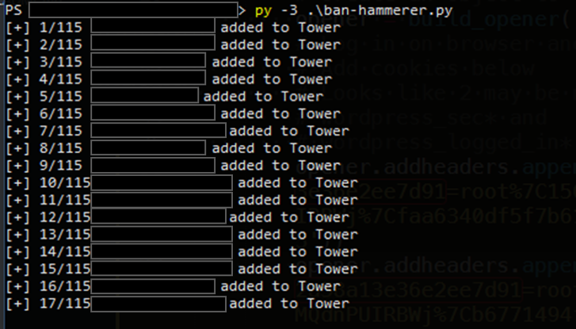

# Banhammerer
Automate blacklisting individual IP addresses with the free WordPress plugin, Banhammer.

## Background
[Banhammer](https://wordpress.org/plugins/banhammer/) is a free Wordpress plugin created by [Jeff Starr](https://plugin-planet.com/) that allows for easy traffic monitoring.  You can view every visitor to your site and what URI they requested (among other details).  Additionally, you can warn or ban specific IP addresses if they appear to be participating in nefarious behavior.

The UI for banning individual visitors is pretty simple and easy to use, but there is a gap (at least in the free version) when it comes to blocking IP addresses that haven't yet visited your site.  If you want to proactively block an IP address, then Jeff added the capability to add individual IP addresses to the blacklist / "Tower" by using a key and URL in the following format:

```
https://example.com/wp-admin/?banhammer-key=[KEY]&banhammer-ip=[IP]
```

This works fine for one or two IP addresses, but what if you maintain a large blacklist and you want to apply that list to banhammer?  100 individual URL changes and requests is not very feasible.  That's the problem that this tool attempts to solve.

## Overview
The tool is pretty simple in concept.  If the only way to blacklist an IP is to individually request URLs containing that IP address, then our solution is simply to take a list of IP addresses and request the appropriate URL for each one.  Banhammerer accepts a .csv file containing only IP addresses that you want to blacklist as input.  It then crafts each of these IPs into a URL, and then requests each one.  There are probably more efficient ways of doing this that utilize less memory, but we can discuss optimization later.

It turns out that, despite having an API key for Banhammer, you still need to be logged into your WordPress site in order to request.  This presents a *slight* barrier to automating the requests.  My workaround is to log in via browser, and then copy the cookies for my session into the script.

The script uses BeautifulSoup4 to parse each response and looks for key words to indicate whether the blacklist was successful or not.  As shown in the screenshot below, as the script runs, it will provide a status update for each request. so that you can identify issues and keep track of progress.



## Configuration
Banhammerer requires a little configuration before you can use it.  There are currently placeholders for your website and your Banhammer key.  There are also several openings for adding your session cookies.  This is critical for the script to work.  You can grab your cookies via a plugin or developer tools to paste them into the script.

## TODO
- [x] Remove input file hardcoding so that user can specify their own file
- [x] Allow input with file or individual IP
- [ ] Add additional optional arguments for specifying site
- [ ] Add additional optional arguments for specifying key
- [ ] Add additional optional arguments for specifying cookies
- [ ] Accept session cookies from file rather then editing script
- [ ] Consider an application password plugin like [this one](https://wordpress.org/plugins/application-passwords/)
